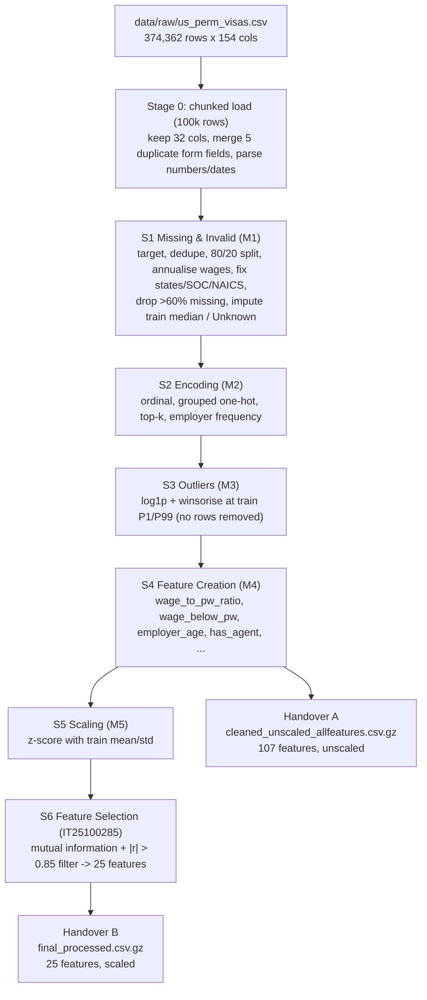

# AIML Group Assignment: US PERM Visa Denial Prediction

**Module:** IT2011 Artificial Intelligence & Machine Learning (Y2S1 2026) · **Group:** 2026-Y02-S1-MLB-B9G1-08
**Task:** binary classification — will a US PERM labor-certification application be **denied**?

This repository contains:
- **Preprocessing (Progress Review I):** six member stage notebooks plus an integrated `group_pipeline.ipynb`, producing two leakage-free, model-ready datasets.
- **Models (Final Evaluation):** one model notebook per member, each saving its results to `results/models/<IT>_<Model>/`, plus a 6-model comparison in `group_pipeline.ipynb`.

---

## 1. Dataset Overview

- **Source:** [US Permanent Visa Applications — Kaggle (jboysen/us-perm-visas)](https://www.kaggle.com/datasets/jboysen/us-perm-visas), originally from the US Department of Labor (OFLC).
- **Raw size:** 374,362 applications × 154 columns (298.6 MB CSV), decisions from 2011 to 2016.
- **Target:** `case_status` → **`denied`**. Denied = 1; Certified and Certified-Expired = 0. *Withdrawn* is dropped because it is the applicant's choice, not a decision.
- **After cleaning:** 354,849 applications, of which **24,524 are denied (6.91%)**. This is a strongly imbalanced problem: predicting "always approve" already scores 93.1% accuracy.
- **Data quality:**
  - The file merges several versions of the DOL form, so the same field appears under different column names.
  - 73 of the 154 columns are more than 60% missing.
  - Wages are stored as text, in 10 different unit spellings.
  - States mix 2-letter codes and full names.
  - Some occupation (SOC) codes are corrupted into dates.
  - There are 1,337 duplicate case IDs.
  - The denial rate drifts from 10–14% (2011–13) to 5–6% (2014–16).

---

## 2. Group Members & Preprocessing Assignments

| Member | IT Number | Technique | Notebook | Input | Output |
|---|---|---|---|---|---|
| **M1** | `IT25101547` | Missing & Invalid Data Handling | [`1_IT25101547_MissingData.ipynb`](notebooks/1_IT25101547_MissingData.ipynb) | `data/raw/us_perm_visas.csv` | `stage1_missing_handled.parquet` |
| **M2** | `IT25103364` | Categorical Encoding | [`2_IT25103364_Encoding.ipynb`](notebooks/2_IT25103364_Encoding.ipynb) | `stage1_missing_handled.parquet` | `stage2_encoded.parquet` |
| **M3** | `IT25101145` | Outlier Treatment | [`3_IT25101145_OutlierRemoval.ipynb`](notebooks/3_IT25101145_OutlierRemoval.ipynb) | `stage2_encoded.parquet` | `stage3_outliers_treated.parquet` |
| **M4** | `IT25102357` | Feature Engineering — Creation | [`4_IT25102357_FeatureEngineering.ipynb`](notebooks/4_IT25102357_FeatureEngineering.ipynb) | `stage3_outliers_treated.parquet` | `stage4_features_created.parquet` |
| **M5** | `IT25103041` | Normalization & Scaling | [`5_IT25103041_Scaling.ipynb`](notebooks/5_IT25103041_Scaling.ipynb) | `stage4_features_created.parquet` | `stage5_scaled.parquet` |
| **M6** | `IT25100285` | Feature Selection & Redundancy Filtering | [`6_IT25100285_FeatureSelection.ipynb`](notebooks/6_IT25100285_FeatureSelection.ipynb) | `stage5_scaled.parquet` + `stage4_features_created.parquet` | **handover B (default) + A (optional)** |
| **Group** | All | Integrated pipeline + model workspaces | [`group_pipeline.ipynb`](group_pipeline.ipynb) | raw CSV | all of the above |

> The numeric prefix (`1_` … `6_`) is the run order of the preprocessing chain. Model notebooks are listed in [section 6](#6-model-phase-final-evaluation).

---

## 3. Sequential Pipeline Architecture



**Every statistic** (imputation medians, category lists, employer counts, percentile caps, scaler mean/std, mutual information, correlations) is **fit on the train rows only** and then applied to the test rows.

---

## 4. Preprocessing Stages & Justifications (summary)

| Stage | What | Why (for this dataset) | EDA plot |
|---|---|---|---|
| 0 | Chunked load; merge duplicate-named fields (citizenship, wage, wage unit, NAICS, case ID) | The 298 MB file contains several form versions; merging brings citizenship missingness from 5.5% to 0.02% and wage from 30.7% to 0.03% | [m0](results/eda_visualizations/m0_dataset_overview.png) (group) |
| 1 | Target, dedupe, split, invalid → NaN, drop >60% missing, impute | Wage units, impossible years and sizes, corrupted SOC codes; missingness encodes the form version, so **no missing flags** | [m1](results/eda_visualizations/m1_missingness_before_after.png) |
| 2 | Ordinal (wage level, education); grouped one-hot (SOC major group, NAICS sector, census region, wage source, top-20 countries, top-10 visa classes); employer frequency | Cardinality ranges from 4 to 71,709 | [m2](results/eda_visualizations/m2_denial_rate_by_category.png) |
| 3 | `log1p` + winsorise at train P1/P99 | Wages up to USD 1M, employer size up to 2.3M; deleting rows would remove the denials | [m3](results/eda_visualizations/m3_outlier_boxplots.png) |
| 4 | 8 domain features | PERM requires offered wage ≥ prevailing wage: below it, **65% are denied vs 6.5%** | [m4](results/eda_visualizations/m4_engineered_feature_signal.png) |
| 5 | z-score on 12 continuous/ordinal columns | Wages (~10⁵) vs ratios (~1) vs codes (0–5) | [m5](results/eda_visualizations/m5_scaling_comparison.png) |
| 6 | Mutual-information ranking + correlation filter → 25 features | 107 sparse candidates; near-duplicate pairs; non-linear threshold effects | [m6](results/eda_visualizations/m6_feature_selection.png) |

### Leakage controls

| Column | Decision |
|---|---|
| `decision_date`, `case_status` | Kept for EDA only, removed in Stage 6 (an assert checks this) |
| Processing time (`decision_date − case_received_date`) | Median 398 days for Denied vs 125 for Certified. Only known after the decision, so **never a feature**; `case_received_date` is dropped in S1 |
| `case_no` / `case_number`, `application_type` | IDs and a form-version proxy, dropped in S1 |
| Missing-indicator flags | Not created, because missingness follows the form version, which tracks the year and the drifting denial rate |
| `employer_name` | Frequency encoding only (no target encoding) |
| `pwsrc_Unknown` (prevailing wage not recorded) | 9.3% of denied vs ~0.4% of approved applications. This is on the form at filing time (an incomplete application), so it is **kept**, but treat it as a shortcut and run an ablation without the `pwsrc_*` columns |

**Sanity check:**
- A quick untuned Logistic Regression on handover B reaches **PR-AUC 0.32** (6.9% random baseline) and **ROC-AUC 0.77**.
- That means the data is learnable, with no signs of leakage.

---

## 5. Handover for the Model Phase

| File (`results/outputs/`) | Contents | Use for |
|---|---|---|
| `final_processed.csv.gz` — **B (DEFAULT)** | 25 selected features (scaled) + `denied` + `split` | **All six models**, and the group comparison, so every model is compared on the same data |
| `cleaned_unscaled_allfeatures.csv.gz` — **A (optional)** | 107 features (unscaled) + `denied` + `split` | Optional "different pre-processing" variety: all features vs the selected 25, or your own scaling/selection inside CV |
| `feature_dictionary.csv` | Meaning, dtype, scaled?, in B? for every column | Report and viva |
| `feature_selection_report.csv`, `selected_features.txt` | MI ranking, redundant pairs, selected list | Report |
| `encoding_maps.json`, `outlier_caps.csv`, `scaler_params.csv` | Fitted preprocessing parameters (all from train) | Reproducibility |

```python
import pandas as pd
df = pd.read_csv('results/outputs/final_processed.csv.gz')   # works in VS Code and Colab
train, test = df[df['split'] == 'train'], df[df['split'] == 'test']
X_train, y_train = train.drop(columns=['denied', 'split']), train['denied']
```

### Train/test split: identical for every member
- The split is **already done** (Stage 1: stratified 80/20, seed 42) and stored in the `split` column of both handover files. **Do not call `train_test_split` again.**
- **train:** 283,879 rows (19,619 denied, 6.91%) · **test:** 70,970 rows (4,905 denied, 6.91%).
- Handover A and B contain the same rows in the same order, so a row is `train` or `test` in both files.
- Cross-validation folds are identical too: everyone uses `StratifiedKFold(n_splits=5, shuffle=True, random_state=42)` on the train rows.
- Slow models (kernel SVM, a Random Forest grid search) may tune on a subsample **of the train rows**, but final scores always come from the full shared test set.

**Rules for all six models** (also written in `group_pipeline.ipynb`):
1. Use **handover B** for your main model and for the group comparison. Handover A is optional.
2. Tune on `split == 'train'` with `StratifiedKFold(n_splits=5, shuffle=True, random_state=42)`. The spec requires k-fold CV and hyperparameter tuning.
3. Use `split == 'test'` **once**, at the end.
4. Report precision, recall and F1 for **Denied**, plus PR-AUC, ROC-AUC, macro-F1 and the confusion matrix. Show accuracy only next to the 93.1% baseline.
5. Handle imbalance with class weights / `scale_pos_weight` (≈13.5). Use SMOTE only inside CV through `imblearn.pipeline.Pipeline`.
6. Train several **varieties** per model, since the Final Evaluation asks for "different pre-processing and hyperparameter tune-ups". Examples:
   - different hyperparameter grids
   - class weights vs SMOTE
   - an extra pipeline step (PCA, polynomial features)
   - optionally, handover A (all features) vs B (selected)

---

## 6. Model Phase (Final Evaluation)

### How it works
Each member builds **their own model in their own notebook**. Models are **not merged**; only their **results** are combined into one comparison table.

```
final_processed.csv.gz   (handover B, same train/test rows for everyone)
        │
        ├── IT25100285_LogisticRegression.ipynb ─┐  each member:
        ├── IT25101547_DecisionTree.ipynb        │  1. try several varieties (5-fold CV on train rows)
        ├── IT25103364_RandomForest.ipynb        │  2. pick the best variety, tune the threshold on train rows
        ├── IT25101145_XGBoost.ipynb             │  3. evaluate on the test rows ONCE
        ├── IT25102357_SVM.ipynb                 │  4. save results to results/models/<IT>_<Model>/
        └── IT25103041_MLP.ipynb                ─┘
                         │
                         ▼
        group_pipeline.ipynb → reads the six test_metrics.json files
                             → comparison table + chart → best model (group mark)
```

### Model notebooks and result folders

| Member | Model | Notebook | Results folder | Status |
|---|---|---|---|---|
| IT25100285 | Logistic Regression | [`IT25100285_LogisticRegression.ipynb`](notebooks/IT25100285_LogisticRegression.ipynb) | `results/models/IT25100285_LogisticRegression/` | Code written, to be run |
| IT25101547 | Decision Tree | [`IT25101547_DecisionTree.ipynb`](notebooks/IT25101547_DecisionTree.ipynb) | `results/models/IT25101547_DecisionTree/` | Done (metrics saved) |
| IT25103364 | Random Forest | `IT25103364_RandomForest.ipynb` | `results/models/IT25103364_RandomForest/` | In review (PR #2) |
| IT25101145 | XGBoost | `IT25101145_XGBoost.ipynb` | `results/models/IT25101145_XGBoost/` | To do |
| IT25102357 | SVM | `IT25102357_SVM.ipynb` | `results/models/IT25102357_SVM/` | To do |
| IT25103041 | MLP | `IT25103041_MLP.ipynb` | `results/models/IT25103041_MLP/` | To do |

**Model notes:**
- **Decision Tree / Random Forest / XGBoost:** scaling doesn't affect trees; handover A is an optional variety. Tune Random Forest on a train subsample if it's slow. XGBoost on macOS needs `brew install libomp`.
- **SVM:** `LinearSVC` on all rows, or RBF on ≤ 30k rows (kernel SVC is O(n²)). It has no `predict_proba`, so use `decision_function` for PR-AUC / ROC-AUC.
- **MLP:** replaces KNN (too slow at 284k rows, weak with one-hot distances). It has no `class_weight`, so use SMOTE inside CV or threshold tuning.

### What every model notebook must contain
1. **Why this model suits the data** (markdown).
2. **Load handover B** with the shared `split` column. No new `train_test_split`.
3. **At least 3 varieties** (hyperparameters, class weights vs SMOTE, A vs B, …), each scored with 5-fold `StratifiedKFold(shuffle=True, random_state=42)` on the train rows: report mean ± std.
4. **Hyperparameter tuning** with `GridSearchCV` / `RandomizedSearchCV` (`scoring='average_precision'`).
5. **A varieties comparison table + chart**, and the best variety chosen by CV (never by the test set).
6. **Threshold** chosen from out-of-fold predictions on the train rows (optional but recommended).
7. **One final test evaluation:** PR-AUC, ROC-AUC, F1 / precision / recall for Denied, confusion matrix, accuracy next to the 93.1% baseline.
8. **Interpretation** (coefficients / feature importances) + limitations.
9. **Save results** to `results/models/<IT>_<Model>/`, including a `test_metrics.json` with these keys:

```json
{
  "member": "IT25100285", "model": "Logistic Regression", "variety": "V3", "dataset": "B",
  "params": {"C": 0.1}, "threshold": 0.72,
  "cv_pr_auc_mean": 0.343, "cv_pr_auc_std": 0.008,
  "test_pr_auc": 0.336, "test_roc_auc": 0.775,
  "test_f1_denied": 0.340, "test_precision_denied": 0.321, "test_recall_denied": 0.361,
  "test_accuracy": 0.903, "baseline_accuracy_always_approve": 0.931
}
```

### Rules for model pull requests
- Work in **your own notebook** (`notebooks/<IT>_<Model>.ipynb`) on a branch, then open a PR. Don't edit other members' files.
- Save model files **only** in `results/models/<IT>_<Model>/`. `results/outputs/` and `results/eda_visualizations/` belong to the preprocessing deliverable.
- Don't use `matplotlib.use("Agg")` in notebooks; it hides all plots.
- Use a descriptive commit message, e.g. `Add Random Forest model (IT25103364)`.

### What is shown in the Final Evaluation viva
| Part | Shown | Marks |
|---|---|---|
| Individual | Your model notebook: suitability, implementation, tuning method, varieties + CV metrics, comparison and conclusion, test result, limitations | 45 each |
| Group | The 6-model comparison table in `group_pipeline.ipynb`, the best performer and why, challenges | 10 |

---

## 7. Repository Structure

```
2026-Y02-S1-MLB-B9G1-08/
├── README.md                     # this file
├── PLAN.md                       # project plan & decisions
├── requirements.txt
├── group_pipeline.ipynb          # integrated pipeline + 6 model workspaces
├── data/
│   ├── raw/us_perm_visas.csv     # download from Kaggle (gitignored: 298 MB)
│   └── external/                 # reference tables: us_states, soc_major_groups, naics_sectors
├── notebooks/
│   ├── 1_IT25101547_MissingData.ipynb … 6_IT25100285_FeatureSelection.ipynb   # preprocessing, run in order
│   └── <IT>_<Model>.ipynb                                                     # one model notebook per member
├── results/
│   ├── eda_visualizations/       # m0–m6 preprocessing plots only
│   ├── logs/pipeline_run.log     # rows/columns per stage from the last run
│   ├── outputs/                  # handover A/B (.csv.gz) + fitted parameters; stage*.parquet are regenerated
│   └── models/
│       ├── <IT>_<Model>/         # one folder per member: test_metrics.json, CV tables, plots, model file
│       └── group_comparison/     # the 6-model comparison table + chart
└── scripts/strip_notebook_runtime.js   # git filter: strips outputs from group_pipeline.ipynb on commit
```

---

## 8. How to Run

### Option A: VS Code / local Jupyter
```bash
python3 -m venv .venv && source .venv/bin/activate
pip install -r requirements.txt
# download us_perm_visas.csv from Kaggle into data/raw/
git config filter.notebook-runtime.clean "node scripts/strip_notebook_runtime.js"   # once per clone
```
- Open `group_pipeline.ipynb`, select the `.venv` kernel and **Run All**. The full pipeline takes about 40 s and uses less than 2 GB of RAM.
- Alternatively, run the stage notebooks in order: `1_…` → `6_…`. Each one reads the previous stage's output.
- Model notebooks only need the handover files in `results/outputs/` (no raw CSV).
- Set `DEV_SAMPLE = 0.10` in the config cell for a fast stratified ~37k-row run.

### Option B: Google Colab
```python
from google.colab import drive
drive.mount('/content/drive')
import os; os.chdir('/content/drive/MyDrive/2026-Y02-S1-MLB-B9G1-08')
```
- **Model work only:** if you are only training a model, you don't need the raw CSV. Load the handover files from `results/outputs/`.

---

## 9. AI Tool Usage (for the report, Section 7)

Claude (Anthropic, Claude Code) was used to plan the pipeline, profile the dataset, draft the preprocessing code and notebooks, draft the Logistic Regression notebook and review pull requests. Every stage notebook contains assert-based verification cells, and the group pipeline checks that its output is identical to the member notebooks' output. Each member should still review, run and be able to explain their own stage before the viva.
